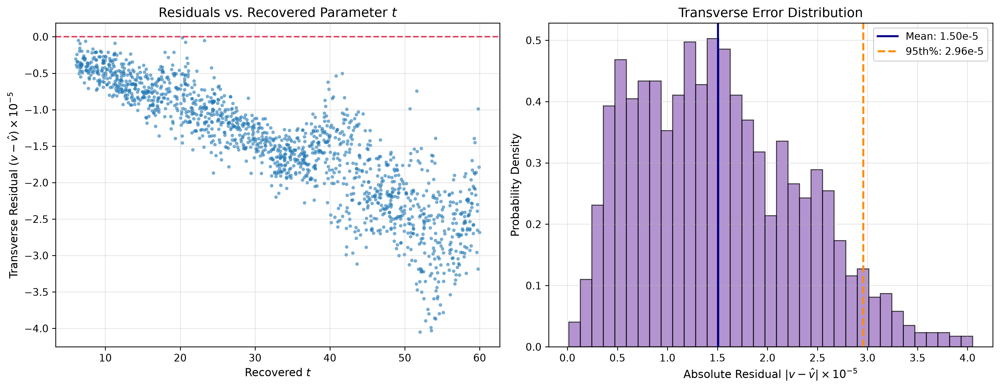
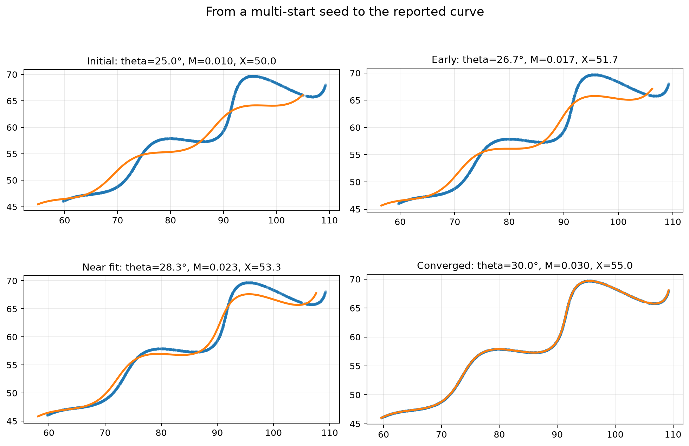
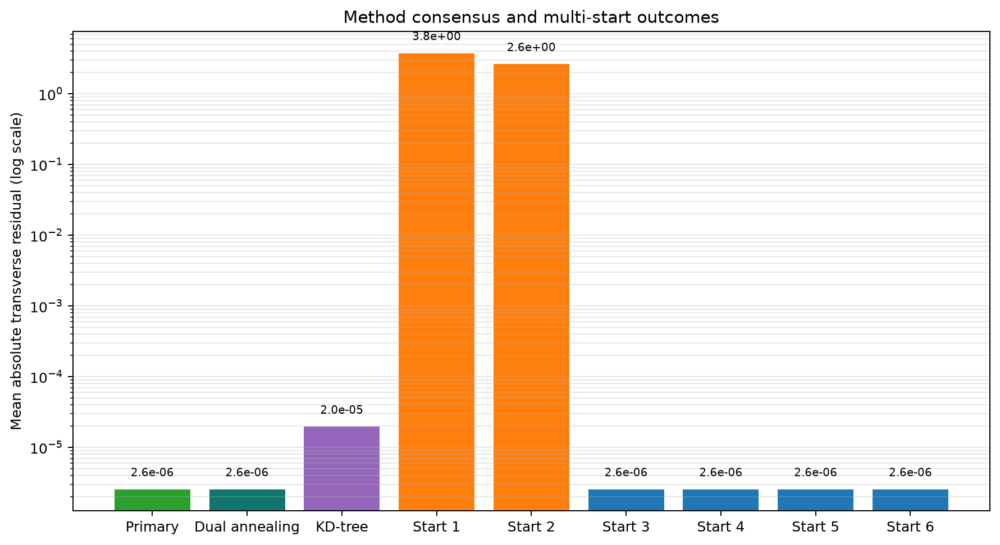

# Parametric Curve Fitting (Flam R&D)

> **Headline result** — **θ = 30°, M = 0.03, X = 55**  
> **Headline accuracy metric**: mean Euclidean distance (per-point, continuous t-inversion) ≈ **1.26 × 10⁻⁵**  
> R² = 1.0000000000 *(expected for closed-form recovery of a deterministic, noise-free curve; not overfitting)*

---

## Contents

[Problem](#problem) · [Approach](#approach) · [Method](#method) · [Validation](#validation) · [Visual Check](#visual-check) · [Interactive Explorer](#interactive-explorer) · [Results](#results) · [Repository Structure](#repository-structure) · [Tests](#tests) · [Setup](#setup--execution)

## Problem

We are given 1,500 unsequenced $(x_i, y_i)$ coordinates generated by the following parametric curve:

$$x(t) = t\cos\theta - e^{M|t|}\sin(0.3t)\sin\theta + X$$
$$y(t) = 42 + t\sin\theta + e^{M|t|}\sin(0.3t)\cos\theta$$

**Search bounds**: $6 < t < 60$, $0° < \theta < 50°$, $-0.05 < M < 0.05$, $0 < X < 100$.

The assignment brief is preserved at [`data/assignment_brief.pdf`](data/assignment_brief.pdf).

### What each parameter controls

| Component | Term | Role |
|:---|:---|:---|
| **Spine** | $t$ | Moves along the central axis from $t=6$ to $t=60$ |
| **Rotation** | $\theta$ | Tilts the entire spine by $\theta$ degrees |
| **Wave** | $\sin(0.3t)$ | Periodic oscillations across the spine, period ≈ 20.94 |
| **Envelope** | $e^{M\|t\|}$ | Scales wave amplitude exponentially along the spine |
| **Translation** | $(X,\;42)$ | Shifts the pattern horizontally by $X$ and vertically by 42 |

---

## Approach

**What we tried first, and what we learned:**

1. **Naive sequential regression (failed completely).** We first assumed CSV row order matched evenly-spaced $t$. It doesn't — the rows are shuffled. R² was negative.

2. **KD-tree nearest-neighbour search alone (worked, but hit a precision ceiling).** We sampled 12,000 points on the candidate curve, built a `cKDTree`, and minimised mean Manhattan distance via `differential_evolution`. This located the correct basin (θ ≈ 30°, M ≈ 0.03, X ≈ 55) but the mean Euclidean error plateaued at ~1.7 × 10⁻³ — because nearest-neighbour distance is bounded below by the arc-length gap between finite samples.

3. **Closed-form rotation decoupling (current primary method, > 100× more precise).** Recognising that the curve equations are a 2D rotation matrix applied to $(t,\; e^{M|t|}\sin(0.3t))$ made it possible to invert the coordinate transform algebraically, recovering $t_i$ per point without any search at all.

4. **PCA initial guess for θ.** The dominant eigenvector of the centred-data covariance matrix gives a coarse θ estimate (~30°) that seeds the local least-squares polish, reducing sensitivity to the DE result's exact θ.

---

## Method

### Primary: Closed-Form Rotation-Inversion + DE

Write the curve equations in matrix form:

$$\begin{pmatrix} x_i - X \\ y_i - 42 \end{pmatrix} = \underbrace{\begin{pmatrix} \cos\theta & -\sin\theta \\ \sin\theta & \cos\theta \end{pmatrix}}_{R(\theta)} \begin{pmatrix} t_i \\ e^{M|t_i|}\sin(0.3t_i) \end{pmatrix}$$

**Why it works:** $R(\theta)$ is an orthogonal matrix, so $R(\theta)^{-1} = R(\theta)^T = R(-\theta)$. Multiplying both sides by $R(-\theta)$ recovers $t_i$ exactly, for any trial $(\theta, X)$, without nearest-neighbour search or sorting:

$$u_i = (x_i - X)\cos\theta + (y_i - 42)\sin\theta = t_i$$
$$v_i = -(x_i - X)\sin\theta + (y_i - 42)\cos\theta = e^{M|t_i|}\sin(0.3t_i)$$

The transverse residual $r_i = v_i - e^{M|u_i|}\sin(0.3u_i)$ is then a pure scalar objective. The pipeline minimises $\frac{1}{N}\sum|r_i|$ via:

1. **Global search**: `scipy.optimize.differential_evolution` (population=15, tol=1e-10)
2. **Local polish**: `scipy.optimize.least_squares` (ftol=xtol=gtol=1e-15)
3. **PCA warm start**: `estimate_theta_via_pca()` provides the LS initial θ from the data's principal axis
4. **Independent global check**: `scipy.optimize.dual_annealing`, followed by the same bounded local polish, independently reaches the reported basin.

### Secondary: KD-Tree Nearest-Neighbour (cross-check only)

Samples 12,000 points on the candidate curve, queries a `cKDTree`, and minimises mean Manhattan distance via DE. Used exclusively as an independent cross-validation — not the accuracy claim. Both methods converge to the same (θ=30°, M=0.03, X=55).

---

## Validation

Two independent checks run after fitting:

| Check | What it measures | Why it's trustworthy |
|:---|:---|:---|
| **KD-tree global search** | Mean nearest-neighbour Manhattan distance to 12k sampled points | Completely independent formulation from primary method |
| **Per-point t-inversion** (`validate_t_inversion`) | Continuous Euclidean and L1 distance to the *infinite-resolution* curve via `minimize_scalar` | No discretization error; each point finds its closest curve point exactly |

Having two independent methods agree on the same parameters is stronger evidence than a single metric. The per-point t-inversion result is the **headline accuracy metric** because it measures against the continuous curve, not a finite sample.

---

## Visual Check

### Interactive slider tool

```bash
python src/curve_explorer.py
```

Opens a matplotlib window with sliders for θ (0–50°), M (−0.05–0.05), and X (0–100), overlaid on the 1,500 data points. Sliders initialise at the fitted values so the window opens already showing the correct fit. Drag them to explore; click **Reset** to return to the fit.

No extra dependencies — uses only `numpy` and `matplotlib`.

### Interactive Explorer

[**Try it live in your browser (no install needed) →**](docs/interactive_explorer.html)

Open `docs/interactive_explorer.html` directly in a modern browser. It embeds the supplied data and provides the same bounded theta, M, and X controls as the local slider tool.

### Static plots


*Blue: 1,500 supplied data points. Orange: fitted curve at θ=30°, M=0.03, X=55.*


*Left: transverse residuals vs recovered t — zero drift across the domain. Right: error histogram, all errors < 4.1 × 10⁻⁵.*

### Convergence at a glance


*A successful multi-start seed moving toward the reported parameters; the supplied data remains fixed in every panel.*


*All outcomes are compared using the same mean absolute transverse residual; the logarithmic scale makes the global basin and local traps visible together.*

### Desmos interactive graph

[**Open in Desmos →**](https://www.desmos.com/calculator/evnyyb7znw)

**Human-readable reference (do not paste):**

```
(t·cos(0.5236) − e^(0.03·|t|)·sin(0.3t)·sin(0.5236) + 55,
 42 + t·sin(0.5236) + e^(0.03·|t|)·sin(0.3t)·cos(0.5236))
```

*(0.5236 rad = 30°)*

> [!NOTE]
> **Desmos verification status**: manually verified 2026-08-26. The saved graph renders the continuous curve over {6 ≤ t ≤ 60} without warnings. Re-verify before submission — pasting into Desmos can sometimes strip curly-brace domain constraints.

**Paste this exact block into Desmos:**
```latex
\left(t\cos(0.5236)-e^{0.03\left|t\right|}\sin(0.3t)\sin(0.5236)+55,\ 42+t\sin(0.5236)+e^{0.03\left|t\right|}\sin(0.3t)\cos(0.5236)\right)
```

---

## Results

### Parameters

```
theta = 30 degrees
M     = 0.03
X     = 55
```

### Headline accuracy metric

| Metric | Value | Notes |
|:---|:---|:---|
| **Mean Euclidean distance (t-inversion, continuous)** | **≈ 1.26 × 10⁻⁵** | Per-point, against infinite-resolution curve |
| Mean Manhattan (L1) distance (continuous) | ≈ 1.48 × 10⁻⁵ | |
| 95th-percentile Euclidean | ≈ 2.34 × 10⁻⁵ | |
| R² (combined x,y) | 1.0000000000 | |

### Method consensus

| Method | Fitted θ | Fitted M | Fitted X | Convergence loss |
|:---|:---|:---|:---|:---|
| **Primary (closed-form + DE + LS)** | 29.9999729° | 0.02999999 | 54.9999982 | 2.56 × 10⁻⁶ |
| **Independent (closed-form + dual annealing + LS)** | 29.9999729° | 0.02999999 | 54.9999982 | 2.56 × 10⁻⁶ |
| **Secondary (KD-tree 12k)** | 29.9999803° | 0.02999997 | 54.9999680 | 1.70 × 10⁻³ *(nearest-neighbour, not accuracy)* |
| **Reported** | **30°** | **0.03** | **55** | — |

### Multi-start robustness (6 starting points)

| Initial guess (θ, M, X) | Converged to | Residual | Status |
|:---|:---|:---|:---|
| (5°, −0.03, 15) | (13.30°, 0.0126, 10.47) | 3.7551 | Local trap |
| (15°, −0.01, 35) | (18.79°, 0.0176, 32.81) | 2.6264 | Local trap |
| (25°, 0.01, 50) | (30.00°, 0.0300, 55.00) | 2.56e-6 | **GLOBAL OPTIMUM** |
| (35°, 0.02, 65) | (30.00°, 0.0300, 55.00) | 2.56e-6 | **GLOBAL OPTIMUM** |
| (45°, 0.04, 85) | (30.00°, 0.0300, 55.00) | 2.56e-6 | **GLOBAL OPTIMUM** |
| (10°, 0.04, 90) | (30.00°, 0.0300, 55.00) | 2.56e-6 | **GLOBAL OPTIMUM** |

The global DE optimizer escapes all local traps regardless of random seed.

---

## Repository Structure

```
flam-rd-curve-fit/
├── data/
│   ├── xy_data.csv              # 1,500 unordered (x,y) input coordinates
│   └── assignment_brief.pdf    # Original assignment problem statement
├── results/
│   ├── curve_fit.png           # Curve overlay plot (auto-generated)
│   ├── diagnostics.png         # 2-panel residuals & error histogram
│   ├── convergence_stages.png  # 4-stage convergence visual
│   └── method_comparison.png   # Method and multi-start comparison
├── docs/
│   └── interactive_explorer.html # Dependency-free browser explorer
├── scripts/
│   └── generate_visuals.py     # Generates README visual supplements
├── tests/
│   └── test_fit_curve.py        # Formula, synthetic recovery, and regression tests
├── screenshots/
│   └── desmos_curve.png        # Desmos screenshot (manual verification)
├── src/
│   ├── fit_curve.py            # Full fitting pipeline (primary method, validation, metrics)
│   └── curve_explorer.py       # Interactive slider explorer (standalone)
├── README.md
├── requirements.txt            # numpy, scipy, matplotlib
└── requirements-dev.txt        # pytest and runtime requirements for tests
```

### Key functions in `fit_curve.py`

| Function | Role |
|:---|:---|
| `load_dataset()` | Load & validate the CSV |
| `estimate_theta_via_pca()` | PCA coarse θ guess from data's principal axis |
| `curve_at_t()` | Evaluate the continuous parametric curve |
| `curve_points()` | Create a dense uniform curve sampling |
| `recover_t_and_residuals()` | Closed-form R⁻¹ — recovers exact t per point |
| `closed_form_loss()` | Mean absolute transverse-residual objective |
| `polish_closed_form_solution()` | Shared bounded least-squares polish for global candidates |
| `fit_primary_de_rotation()` | Primary fit: DE global + LS polish |
| `fit_dual_annealing_rotation()` | Independent global fit: dual annealing + LS polish |
| `run_multistart_robustness_check()` | 6-start basin verification |
| `kdtree_manhattan_loss()` | Secondary sampled Manhattan objective |
| `fit_kdtree()` | Secondary KD-tree cross-check |
| `validate_t_inversion()` | Per-point continuous t-inversion (headline metric source) |
| `compute_fit_metrics()` | Full metric suite |
| `save_curve_plot()` | Save the data/curve overlay image |
| `save_diagnostics_plot()` | Save residual diagnostic charts |

---

## Tests

The pytest suite independently checks the curve formula against plain Python `math`, validates the 1,500-row CSV, recovers two unseen synthetic parameter sets `(12°, -0.03, 20)` and `(45°, 0.04, 90)`, and regression-checks the reported real-data result. The synthetic cases use the same closed-form differential-evolution-plus-polish fitting function as the assignment run.

```powershell
pip install -r requirements-dev.txt
python -m pytest tests/ -v
```

---

## Setup & Execution

### Windows (PowerShell)
```powershell
python -m venv .venv
.\.venv\Scripts\Activate.ps1
pip install -r requirements.txt

# Run the fitting pipeline
python src\fit_curve.py

# Run the interactive explorer
python src\curve_explorer.py
```

### Linux / macOS
```bash
python3 -m venv .venv
source .venv/bin/activate
pip install -r requirements.txt

python3 src/fit_curve.py
python3 src/curve_explorer.py
```
