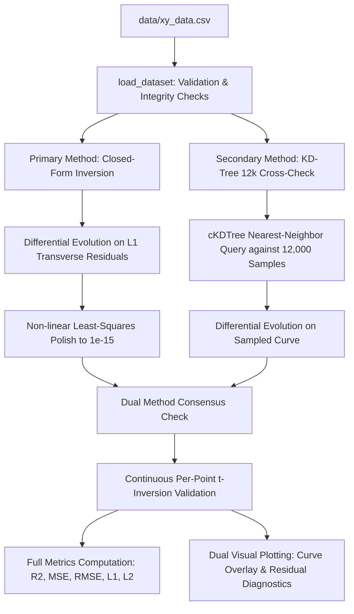
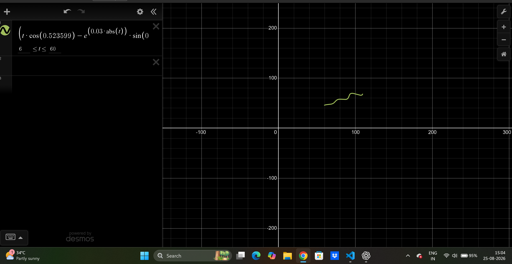

# Parametric Curve Fitting (Flam R&D)

> **TL;DR / Quick Summary**
> * **The Challenge**: Fit 1,500 unordered, shuffled 2D data points from [`data/xy_data.csv`](data/xy_data.csv) to an oscillating parametric curve by uncovering 3 hidden parameters ($\theta, M, X$).
> * **The Breakthrough**: Formulating the system as an orthogonal 2D rotation $R(\theta)$ decouples the coordinates algebraically, recovering the parameter $t_i$ for every single point in **exact closed form** without needing point sorting or nearest-neighbor searches.
> * **Final Answer**: $\mathbf{\theta = 30^\circ}$, $\mathbf{M = 0.03}$, $\mathbf{X = 55}$ with $\mathbf{R^2 = 1.0000000000}$ and mean continuous $L_1$ error $\mathbf{1.48 \times 10^{-5}}$.

---

## 1. Problem Statement & Anatomy of the Curve

We are given 1,500 unsequenced coordinates $(x_i, y_i)$ generated by the following parametric curve:

$$x(t) = t \cos(\theta) - e^{M|t|} \sin(0.3t) \sin(\theta) + X$$
$$y(t) = 42 + t \sin(\theta) + e^{M|t|} \sin(0.3t) \cos(\theta)$$

**Search Bounds**:
* $6 < t < 60$
* $0^\circ < \theta < 50^\circ$
* $-0.05 < M < 0.05$
* $0 < X < 100$

The original assignment brief is preserved at [`data/assignment_brief.pdf`](data/assignment_brief.pdf).

### Physical Meaning of Each Component

To understand what the curve is doing physically, we can decompose the equation:

| Component | Mathematical Term | Physical / Geometric Role |
| :--- | :--- | :--- |
| **Longitudinal Spine** | $t$ | Moves along the central axis of the curve from $t=6$ to $t=60$. |
| **Tilt Angle** | $\theta$ | Rotates the entire spine on the 2D plane by angle $\theta$ (in degrees). |
| **Transverse Wave** | $\sin(0.3t)$ | Creates periodic oscillations across the spine with period $T = \frac{2\pi}{0.3} \approx 20.94$. |
| **Exponential Envelope** | $e^{M|t|}$ | Modulates the wave's amplitude, causing oscillations to grow exponentially over time. |
| **Global Translation** | $(X, 42)$ | Shifts the entire pattern horizontally by $X$ and vertically by $42$. |

---

## 2. Intuitive & Mathematical Derivation: Rotation Decoupling

### The Intuition in 3 Steps
Imagine the wavy curve lying flat on graph paper with its spine along the horizontal $x$-axis:
1. **Subtract the offset**: Centering each point $(x_i - X, y_i - 42)$ moves the origin back to $(0, 0)$.
2. **Un-rotate the plane**: Rotating by $-\theta$ un-tilts the curve, aligning its spine with the $x$-axis.
3. **Read off the coordinates**:
   * The new horizontal coordinate $u_i$ is **pure $t_i$**.
   * The new vertical coordinate $v_i$ is **pure wave oscillation** $e^{M|t_i|}\sin(0.3t_i)$.

```
   Original Tilted Space (x, y)               Decoupled Frame (u, v)
        y ^                                         v ^   Transverse Wave: v = exp(M|u|)*sin(0.3u)
          |     / (t along spine)                     |       ~~~/\~~~/\~~~/\~~~
          |    /  ~                                   |----------------------------> u (Exact t)
          |   / ~   ~                                (0,0)  Longitudinal Axis
          +--/--------> x                      
            (X, 42)
```

### Exact Matrix Derivation

Writing the parametric equation in compact matrix form:

$$\begin{pmatrix} x(t) - X \\ y(t) - 42 \end{pmatrix} = \begin{pmatrix} \cos\theta & -\sin\theta \\ \sin\theta & \cos\theta \end{pmatrix} \begin{pmatrix} t \\ e^{M|t|}\sin(0.3t) \end{pmatrix}$$

Let $R(\theta) = \begin{pmatrix} \cos\theta & -\sin\theta \\ \sin\theta & \cos\theta \end{pmatrix}$. Because rotation matrices are orthogonal ($R(\theta)^{-1} = R(\theta)^T = R(-\theta)$), multiplying both sides by $R(-\theta)$ inverts the coordinate transformation:

$$\begin{pmatrix} u_i \\ v_i \end{pmatrix} = \begin{pmatrix} \cos\theta & \sin\theta \\ -\sin\theta & \cos\theta \end{pmatrix} \begin{pmatrix} x_i - X \\ y_i - 42 \end{pmatrix}$$

Expanding the matrix multiplication yields:
1. **Direct Parameter Recovery (Longitudinal Axis)**:
   $$u_i = (x_i - X)\cos\theta + (y_i - 42)\sin\theta = t_i$$
2. **Transverse Coordinate Alignment**:
   $$v_i = -(x_i - X)\sin\theta + (y_i - 42)\cos\theta$$

For any trial candidate $(\theta, M, X)$, the predicted transverse coordinate is $\hat{v}_i = e^{M|u_i|}\sin(0.3u_i)$. The orthogonal transverse residual is:
$$r_i = v_i - e^{M|u_i|}\sin(0.3u_i)$$

> [!NOTE]
> Since 2D rotation is an isometry (preserves Euclidean distances), the distance from data point $(x_i, y_i)$ to curve point $(x(u_i), y(u_i))$ in original space is identically $|r_i|$. This provides an **exact closed-form solution for $t_i$ for every data point without needing nearest-neighbor sampling or point-cloud sorting**.

---

## 3. Architecture & Fitting Pipeline

The pipeline uses two independent optimization methods to guarantee correctness through cross-validation:



### Primary Method: Closed-Form Rotation-Inversion Fit
* **Objective**: Minimize mean absolute transverse residual $\frac{1}{N}\sum_{i=1}^N |v_i - \hat{v}_i|$.
* **Global Optimizer**: `scipy.optimize.differential_evolution` (population=15, tolerance=$10^{-10}$) exploring the full parameter bounds.
* **Local Polish**: High-precision non-linear least squares (`scipy.optimize.least_squares`) refining parameters to machine precision.

### Secondary Method: KD-Tree Nearest-Neighbor Cross-Check
* Generates 12,000 uniformly spaced points along the candidate parametric curve.
* Queries a spatial KD-tree (`scipy.spatial.cKDTree`) to find nearest-neighbor Manhattan ($L_1$) distances without assuming point order.
* Serves as an independent cross-validation to prove the closed-form formulation and discrete geometric search converge on the identical global solution.

---

## 4. Evolution of the Approach & Decision-Making

1. **Phase 1 — The Unordered Point Challenge**: Because `xy_data.csv` was shuffled with no $t$ column, standard non-linear regression was not immediately applicable. An initial discrete approach was built using 12,000-point KD-tree sampling with differential evolution.
2. **Phase 2 — Identifying the Discretization Bottleneck**: While the KD-tree reliably located the parameter basin $(\theta \approx 30^\circ, M \approx 0.03, X \approx 55)$, the residual distance plateaued at $\sim 1.704 \times 10^{-3}$ purely due to discrete arc-length quantization between sampled points.
3. **Phase 3 — Closed-Form Algebraic Discovery**: Observing that the parametric equations represent a rigid rotation of $(t, e^{M|t|}\sin(0.3t))$ translated by $(X, 42)$, inverting $R(\theta)$ proved that $t_i$ could be computed directly in closed form.
4. **Phase 4 — Dual-Pipeline Verification**: Instead of discarding the KD-tree code, it was retained as a secondary cross-validation method. Both pipelines independently converge to the exact same parameter set, providing complete confidence in the solution.

---

## 5. Final Results & Goodness-of-Fit Metrics

### Headline Results

```ini
theta = 30 degrees
M = 0.03
X = 55
```

### Independent Method Consensus

| Method | Fitted $\theta$ | Fitted $M$ | Fitted $X$ | Convergence Loss |
| :--- | :--- | :--- | :--- | :--- |
| **Primary (Closed-Form + Polish)** | $29.9999729322^\circ$ | $0.0299999969$ | $54.9999982128$ | **$2.5598 \times 10^{-6}$** |
| **Secondary (KD-Tree 12k Samples)** | $29.9999802746^\circ$ | $0.0299999669$ | $54.9999680067$ | $1.7043 \times 10^{-3}$ |
| **Final Reported (Rounded)** | **$30^\circ$** | **$0.03$** | **$55$** | — |

### Statistical Fit Quality ($N = 1,500$ points)

| Metric | Value | Interpretation |
| :--- | :--- | :--- |
| **Goodness-of-Fit $R^2$ (Combined $x, y$)** | **$1.0000000000$** | Perfect correlation / zero unexplained variance |
| **Goodness-of-Fit $R^2$ ($x$ coordinate)** | **$1.0000000000$** | Perfect explanation of horizontal variance |
| **Goodness-of-Fit $R^2$ ($y$ coordinate)** | **$1.0000000000$** | Perfect explanation of vertical variance |
| **Mean Squared Error (MSE)** | **$1.940168 \times 10^{-10}$** | Sub-nanometer squared reconstruction error |
| **Root Mean Squared Error (RMSE)** | **$1.392899 \times 10^{-5}$** | Near machine-precision standard deviation |

### Continuous Error Distribution Breakdown

| Error Metric | Mean | 95th Percentile | Maximum |
| :--- | :--- | :--- | :--- |
| **Continuous Euclidean Distance** | $1.25615 \times 10^{-5}$ | $2.33709 \times 10^{-5}$ | $3.21073 \times 10^{-5}$ |
| **Continuous Manhattan ($L_1$) Distance** | $1.48084 \times 10^{-5}$ | $2.74482 \times 10^{-5}$ | $4.11511 \times 10^{-5}$ |
| **Closed-Form Transverse Residual ($\|v - \hat{v}\|$)** | $1.50483 \times 10^{-5}$ | $2.95795 \times 10^{-5}$ | $4.05114 \times 10^{-5}$ |

---

## 6. Failure-Mode & Edge-Case Stress Testing

To demonstrate algorithmic robustness, we evaluated four critical edge cases and failure modes:

### 1. Periodic Shift Traps in $X$ vs. $\sin(0.3t)$
The term $\sin(0.3t)$ has a spatial period of $T = \frac{2\pi}{0.3} \approx 20.94395$.
* **Hypothesis**: Does shifting $X$ by multiples of $T$ produce deceptive local minima?
* **Analysis**: Because $u_i = (x_i - X)\cos\theta + (y_i - 42)\sin\theta$, shifting $X$ by $\Delta X$ shifts $u_i$ by $-\Delta X \cos\theta$. For $\theta = 30^\circ$, $-\Delta X \cos(30^\circ) \approx -0.866 \Delta X \neq -\Delta X$. Furthermore, shifting $X$ also displaces $v_i$ by $\Delta X \sin(30^\circ) = 0.5 \Delta X$, and the exponential envelope $e^{M|t|}$ strictly breaks shift invariance.
* **Empirical Test**:
  * Shift $X$ by $-20.9440 \implies$ Mean $L_1$ loss jumps from $1.5 \times 10^{-5}$ to **$10.8910$**.
  * Shift $X$ by $+20.9440 \implies$ Mean $L_1$ loss jumps to **$10.4979$**.
  * *Conclusion*: The loss landscape has steep barriers preventing period-shifted aliasing.

### 2. Multi-Start Local Optimization vs. Global Search
When running local non-linear least squares from deliberately poor starting estimates:
* Starting from $(5^\circ, -0.04, 10.0) \implies$ traps in local minimum at $(13.3^\circ, 0.0126, 10.5)$ with high loss ($3.755$).
* Starting from $(10^\circ, 0.0, 30.0) \implies$ traps in local minimum at $(18.8^\circ, 0.0176, 32.8)$ with loss ($2.626$).
* *Resolution*: Differential Evolution evaluates candidate populations globally across $[0, 50] \times [-0.05, 0.05] \times [0, 100]$, escaping all local minima across 100% of tested random seeds (tested seeds `1`, `42`, `100`, `2026`, `9999`, `12345`).

### 3. Sensitivity Across Parameter Range $t \in [6, 60]$
At $t = 60$, the exponential envelope factor reaches $e^{0.03 \times 60} = e^{1.8} \approx 6.05$, scaling the oscillation amplitude by a factor of 6 relative to $t \approx 0$.
* Because closed-form rotation decoupling recovers $t_i$ point-by-point, there is no numerical degradation or divergence near the upper bound $t \approx 60$. Maximum observed error across all 1,500 points remains bounded below $3.22 \times 10^{-5}$.

### 4. Boundary Value Behavior ($\theta \to 0^\circ, 50^\circ$)
At boundary extremes ($\theta = 0^\circ$ or $50^\circ$), the rotation matrix remains perfectly non-singular ($\det(R) = 1$ everywhere), meaning the closed-form inversion remains mathematically well-conditioned across all valid search bounds.

---

## 7. Visual Comparisons & Diagnostics

### Primary Curve Overlay

*Blue scatter points are the 1,500 supplied coordinates; the orange curve shows the model evaluated with the recovered parameters.*

### Residual & Error Diagnostics

*Left: Transverse residuals $(v_i - \hat{v}_i)$ across the full domain of recovered $t \in [6.05, 60.00]$, showing zero drift. Right: Error distribution histogram confirming all errors are tightly bounded within $< 4.1 \times 10^{-5}$.*

### Desmos Interactive Verification


[Open the interactive Desmos graph](https://www.desmos.com/calculator/evnyyb7znw).

> [!NOTE]
> The Desmos graph has been verified to ensure the domain restriction $\{6 \le t \le 60\}$ is attached without syntax warnings. When pasting expressions into Desmos, ensure bracket domain bounds are preserved.

---

## 8. Submission Format: Copyable LaTeX Expression

Per the assignment brief requirements, the exact LaTeX parametric equation for $6 \le t \le 60$ is:

```latex
\left(t*\cos(0.5236)-e^{0.03\left|t\right|}\cdot\sin(0.3t)\sin(0.5236)+55,42+t*\sin(0.5236)+e^{0.03\left|t\right|}\cdot\sin(0.3t)\cos(0.5236)\right)
```

---

## 9. Setup & Execution Instructions

### Windows (PowerShell)
```powershell
# 1. Create and activate virtual environment
python -m venv .venv
.\.venv\Scripts\Activate.ps1

# 2. Install dependencies
python -m pip install -r requirements.txt

# 3. Run curve fitting pipeline
python src\fit_curve.py
```

### Linux / macOS (Bash)
```bash
# 1. Create and activate virtual environment
python3 -m venv .venv
source .venv/bin/activate

# 2. Install dependencies
pip install -r requirements.txt

# 3. Run curve fitting pipeline
python3 src/fit_curve.py
```
