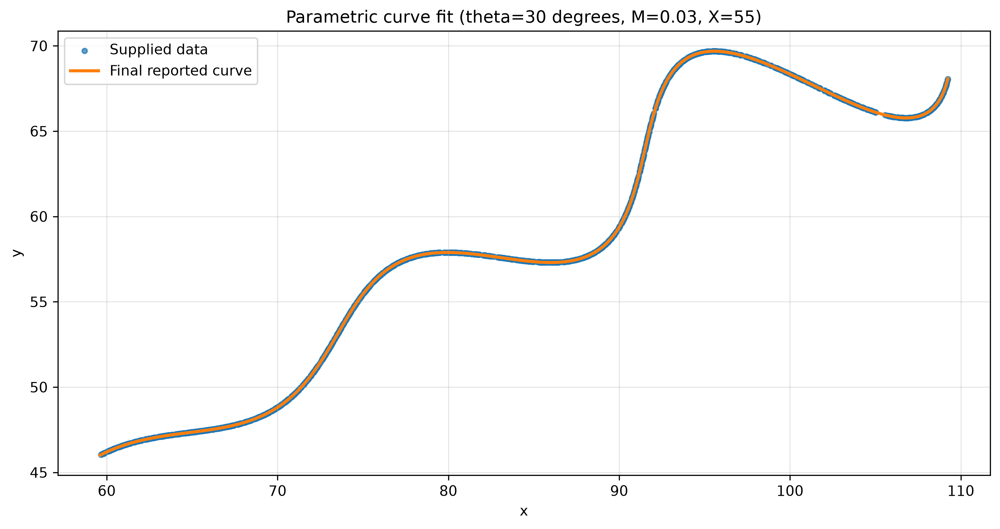

# Parametric Curve Fitting

## Problem

This project fits the 1,500 unordered `(x, y)` points in `data/xy_data.csv` to this parametric curve:

```text
x = t*cos(theta) - exp(M*abs(t))*sin(0.3*t)*sin(theta) + X
y = 42 + t*sin(theta) + exp(M*abs(t))*sin(0.3*t)*cos(theta)
```

The valid ranges are `6 < t < 60`, `0 < theta < 50 degrees`, `-0.05 < M < 0.05`, and `0 < X < 100`. The program receives `theta` in degrees and converts it to radians before evaluating the curve.

The original assignment brief is included at `data/R&D assignment pdf.pdf` for reference.

## Method

The CSV order is arbitrary, so a row cannot be paired directly with an evenly sampled value of `t`. Each point has its own unknown `t`, unrelated to its row number.

For each trial parameter set, the script samples the curve at 12,000 `t` values, builds a KD-tree for those samples, and finds the nearest curve point for every supplied point. The fitting objective is the mean nearest-point **Manhattan/L1 distance**: `|dx| + |dy|`. SciPy differential evolution uses this objective to locate the parameter region globally.

The CSV provides no per-row `t` value, so each point's true position on the curve is unknown. Nearest-point distance therefore scores how well a candidate `(theta, M, X)` explains the observed point cloud without assuming row order or correspondence. The later per-point `t`-inversion validation independently cross-checks this correspondence-free search, confirming that it did not converge on a coincidentally close but incorrect parameter set.

That KD-tree Manhattan/L1 value depends on the density of the 12,000-point sampled curve, so it is useful as a search objective and convergence indicator, not as the final accuracy claim.

## Result

The final reported parameters are:

```ini
theta = 30 degrees
M = 0.03
X = 55
```

The script may print long differential-evolution values as convergence evidence only. The rounded values above are the final answer.

For the current run, the sampled mean nearest-point Manhattan/L1 convergence score is `1.7043183383e-03`; the score for the final reported parameters is `1.7044074408e-03`. Both values use 12,000 curve samples and are not continuous-curve accuracy claims.

## Final Answer (LaTeX / Desmos)

This is the copyable Desmos parametric expression for `6 <= t <= 60`, submitted per the assignment's required Submission Format of writing or copying the equation in LaTeX format in the README.

```text
\left(t*\cos(0.5236)-e^{0.03\left|t\right|}\cdot\sin(0.3t)\sin(0.5236)+55,42+t*\sin(0.5236)+e^{0.03\left|t\right|}\cdot\sin(0.3t)\cos(0.5236)\right)
```

## Curve comparison



The blue points are the supplied data and the orange curve uses the final fitted parameters.

## Run in VS Code

Open this folder in VS Code, then run these commands in the integrated PowerShell terminal:

```powershell
py -m venv .venv
.\.venv\Scripts\Activate.ps1
python -m pip install -r requirements.txt
python src\fit_curve.py
```

The script saves the plot to `results/curve_fit.png`.

## Validation

Parameters were located with KD-tree Manhattan/L1 differential evolution using 12,000 sampled curve points and then confirmed with independent per-point `t` inversion. The t-inversion result is the authoritative validation because it minimizes distance on the continuous curve rather than against the finite KD-tree sampling.

For every supplied point, the script first finds the best position on a coarse `t` grid, then uses bounded local minimization over the adjacent interval. With the final reported parameters, the current script prints a mean Euclidean reconstruction distance of `1.2570764332e-05` and a maximum of `3.2113112739e-05`.

Final reported values are `theta = 30 degrees`, `M = 0.03`, and `X = 55`.
