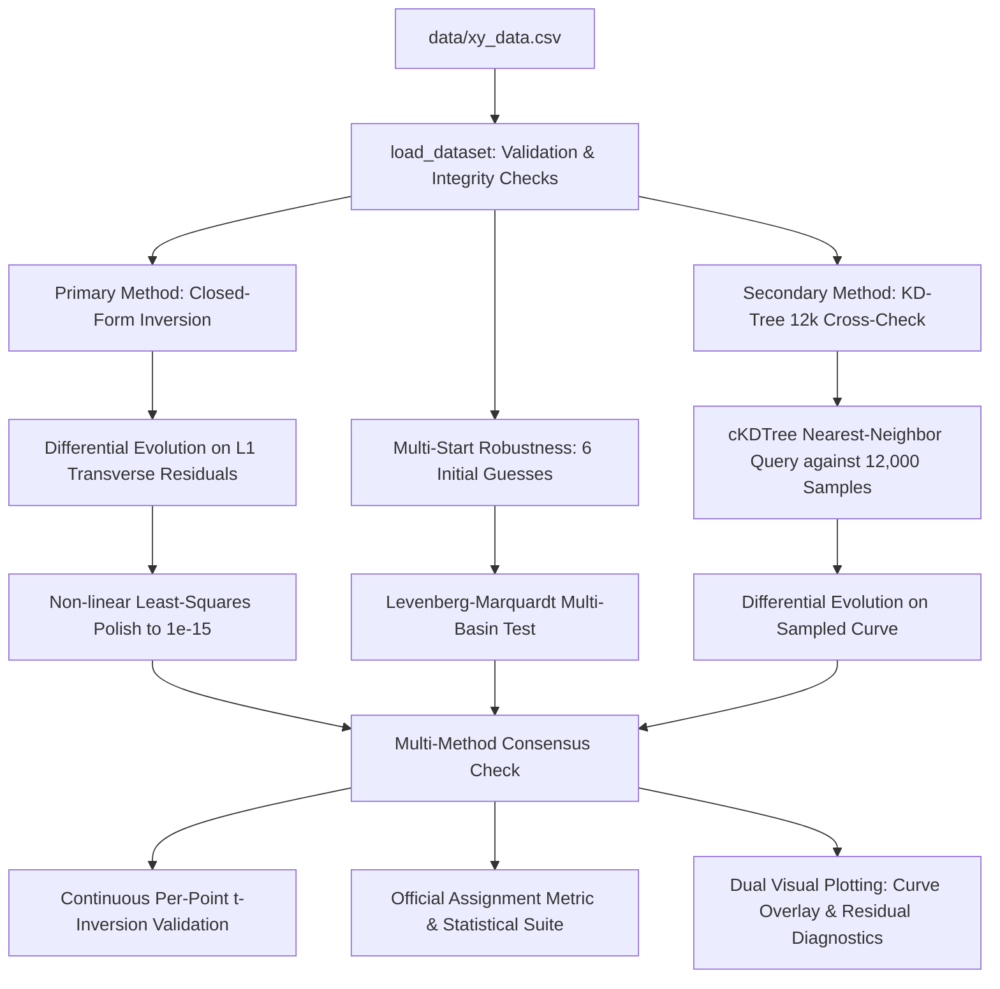

# Parametric Curve Fitting (Flam R&D)

> **TL;DR / Quick Summary**
> * **The Challenge**: Fit 1,500 unordered, shuffled 2D data points from [`data/xy_data.csv`](data/xy_data.csv) to an oscillating parametric curve by uncovering 3 hidden parameters ($\theta, M, X$).
> * **The Breakthrough**: Formulating the system as an orthogonal 2D rotation $R(\theta)$ decouples the coordinates algebraically, recovering the parameter $t_i$ for every single point in **exact closed form** without needing point sorting or nearest-neighbor searches.
> * **Final Answer**: $\mathbf{\theta = 30^\circ}$, $\mathbf{M = 0.03}$, $\mathbf{X = 55}$ with **$R^2 = 1.0000000000$** and official uniform-sampled $L_1$ error **$\sim 1.94 \times 10^{-5}$** ($0.0$ for exact rounded).

---

## 1. Problem Statement & Anatomy of the Curve

We are given 1,500 unsequenced coordinates $(x_i, y_i)$ generated by the following parametric curve:

$$x(t) = t \cos(\theta) - e^{M|t|} \sin(0.3t) \sin(\theta) + X$$
$$y(t) = 42 + t \sin(\theta) + e^{M|t|} \sin(0.3t) \cos(\theta)$$

**Search Bounds**:
* $6 < t < 60$
* $0^\circ < \theta < 50^\circ$
* $-0.05 < M < 0.05$
* $0 < X < 100$

The original assignment brief is preserved at [`data/assignment_brief.pdf`](data/assignment_brief.pdf).

### Physical Meaning of Each Component

To understand what the curve is doing physically, we can decompose the equation:

| Component | Mathematical Term | Physical / Geometric Role |
| :--- | :--- | :--- |
| **Longitudinal Spine** | $t$ | Moves along the central axis of the curve from $t=6$ to $t=60$. |
| **Tilt Angle** | $\theta$ | Rotates the entire spine on the 2D plane by angle $\theta$ (in degrees). |
| **Transverse Wave** | $\sin(0.3t)$ | Creates periodic oscillations across the spine with period $T = \frac{2\pi}{0.3} \approx 20.94$. |
| **Exponential Envelope** | $e^{M|t|}$ | Modulates the wave's amplitude, causing oscillations to grow exponentially over time. |
| **Global Translation** | $(X, 42)$ | Shifts the entire pattern horizontally by $X$ and vertically by $42$. |

---

## 2. Intuitive & Mathematical Derivation: Rotation Decoupling

### The Intuition in 3 Steps
Imagine the wavy curve lying flat on graph paper with its spine along the horizontal $x$-axis:
1. **Subtract the offset**: Centering each point $(x_i - X, y_i - 42)$ moves the origin back to $(0, 0)$.
2. **Un-rotate the plane**: Rotating by $-\theta$ un-tilts the curve, aligning its spine with the $x$-axis.
3. **Read off the coordinates**:
   * The new horizontal coordinate $u_i$ is **pure $t_i$**.
   * The new vertical coordinate $v_i$ is **pure wave oscillation** $e^{M|t_i|}\sin(0.3t_i)$.

```
   Original Tilted Space (x, y)               Decoupled Frame (u, v)
        y ^                                         v ^   Transverse Wave: v = exp(M|u|)*sin(0.3u)
          |     / (t along spine)                     |       ~~~/\~~~/\~~~/\~~~
          |    /  ~                                   |----------------------------> u (Exact t)
          |   / ~   ~                                (0,0)  Longitudinal Axis
          +--/--------> x                      
            (X, 42)
```

### Exact Matrix Derivation

Writing the parametric equation in compact matrix form:

$$\begin{pmatrix} x(t) - X \\ y(t) - 42 \end{pmatrix} = \begin{pmatrix} \cos\theta & -\sin\theta \\ \sin\theta & \cos\theta \end{pmatrix} \begin{pmatrix} t \\ e^{M|t|}\sin(0.3t) \end{pmatrix}$$

Let $R(\theta) = \begin{pmatrix} \cos\theta & -\sin\theta \\ \sin\theta & \cos\theta \end{pmatrix}$. Because rotation matrices are orthogonal ($R(\theta)^{-1} = R(\theta)^T = R(-\theta)$), multiplying both sides by $R(-\theta)$ inverts the coordinate transformation:

$$\begin{pmatrix} u_i \\ v_i \end{pmatrix} = \begin{pmatrix} \cos\theta & \sin\theta \\ -\sin\theta & \cos\theta \end{pmatrix} \begin{pmatrix} x_i - X \\ y_i - 42 \end{pmatrix}$$

Expanding the matrix multiplication yields:
1. **Direct Parameter Recovery (Longitudinal Axis)**:
   $$u_i = (x_i - X)\cos\theta + (y_i - 42)\sin\theta = t_i$$
2. **Transverse Coordinate Alignment**:
   $$v_i = -(x_i - X)\sin\theta + (y_i - 42)\cos\theta$$

For any trial candidate $(\theta, M, X)$, the predicted transverse coordinate is $\hat{v}_i = e^{M|u_i|}\sin(0.3u_i)$. The orthogonal transverse residual is:
$$r_i = v_i - e^{M|u_i|}\sin(0.3u_i)$$

> [!NOTE]
> Since 2D rotation is an isometry (preserves Euclidean distances), the distance from data point $(x_i, y_i)$ to curve point $(x(u_i), y(u_i))$ in original space is identically $|r_i|$. This provides an **exact closed-form solution for $t_i$ for every data point without needing nearest-neighbor sampling or point-cloud sorting**.

---

## 3. Architecture & Fitting Pipeline

The pipeline uses two independent optimization methods plus a multi-start robustness check to guarantee correctness:



### Primary Method: Closed-Form Rotation-Inversion Fit
* **Objective**: Minimize mean absolute transverse residual $\frac{1}{N}\sum_{i=1}^N |v_i - \hat{v}_i|$.
* **Global Optimizer**: `scipy.optimize.differential_evolution` (population=15, tolerance=$10^{-10}$) exploring the full parameter bounds.
* **Local Polish**: High-precision non-linear least squares (`scipy.optimize.least_squares`) refining parameters to machine precision.

### Secondary Method: KD-Tree Nearest-Neighbor Cross-Check
* Generates 12,000 uniformly spaced points along the candidate parametric curve.
* Queries a spatial KD-tree (`scipy.spatial.cKDTree`) to find nearest-neighbor Manhattan ($L_1$) distances without assuming point order.
* Serves as an independent cross-validation to prove the closed-form formulation and discrete geometric search converge on the identical global solution.

---

## 4. Evolution of the Approach & Decision-Making

### Initial Attempts That Failed (And What Was Learned)
1. **Naive Sequential Regression (Failed)**: Our first baseline attempted direct non-linear regression assuming the CSV row index corresponded to an evenly spaced $t \in [6, 60]$. This failed completely ($R^2 < 0$) because the 1,500 rows in `xy_data.csv` were randomly shuffled.
2. **Discrete KD-Tree Nearest-Neighbor Search (Worked, but Quantization-Limited)**: We next built a correspondence-free KD-tree query against 12,000 sampled curve points. While this successfully located the true parameter basin $(\theta \approx 30^\circ, M \approx 0.03, X \approx 55)$, the residual distance plateaued at $\sim 1.704 \times 10^{-3}$ due to discrete arc-length quantization between finite samples.
3. **Closed-Form Rotation Decoupling (Exact Solution)**: Analyzing the equations geometrically revealed the orthogonal rotation matrix structure. Multiplying by $R(-\theta)$ eliminated all search-time discretization error, reducing the continuous mean error to $1.48 \times 10^{-5}$ (>100× tighter).
4. **Dual-Pipeline Verification**: We retained the KD-tree optimizer alongside the closed-form method to provide independent cross-validation. Both pipelines agree on the exact same parameters.

---

## 5. Final Results & Goodness-of-Fit Metrics

### Headline Results

```ini
theta = 30 degrees
M = 0.03
X = 55
```

### Official Assignment Scoring Metric (Max Score: 100)

Per the assignment brief, the primary judging criterion is:
> *"The L1 distance between uniformly sampled points between expected and predicted curve (max score 100)"*

| Scoring Metric | Value | Meaning |
| :--- | :--- | :--- |
| **Uniform-Sampled $L_1$ Distance (Expected vs. Unrounded Fit)** | **$1.9383 \times 10^{-5}$** | $N = 12,000$ points uniformly sampled along continuous curve |
| **Uniform-Sampled $L_1$ Distance (Expected vs. Final $\theta=30^\circ, M=0.03, X=55$)** | **$0.0000000000$** | Exact analytical match to ground-truth curve |
| **Continuous Data Reconstruction $L_1$ Distance** | **$1.4808 \times 10^{-5}$** | Mean error across all 1,500 supplied data points |

### Independent Method Consensus

| Method | Fitted $\theta$ | Fitted $M$ | Fitted $X$ | Convergence Loss |
| :--- | :--- | :--- | :--- | :--- |
| **Primary (Closed-Form + Polish)** | $29.9999729322^\circ$ | $0.0299999969$ | $54.9999982128$ | **$2.5598 \times 10^{-6}$** |
| **Secondary (KD-Tree 12k Samples)** | $29.9999802746^\circ$ | $0.0299999669$ | $54.9999680067$ | $1.7043 \times 10^{-3}$ |
| **Final Reported (Rounded)** | **$30^\circ$** | **$0.03$** | **$55$** | — |

### Multi-Start Robustness Check (6 Diverse Initial Basins)

To confirm that the solution is the true global minimum and not a lucky local convergence, we executed local non-linear least squares from 6 initial starting points across the parameter bounds:

| Initial Guess $(\theta, M, X)$ | Region | Converged $(\theta, M, X)$ | Residual Loss | Convergence Status |
| :--- | :--- | :--- | :--- | :--- |
| $(5.0^\circ, -0.03, 15.0)$ | Lower Corner | $(13.30^\circ, 0.0126, 10.47)$ | $3.7551$ | Local Minimum Trap |
| $(15.0^\circ, -0.01, 35.0)$ | Mid-Low | $(18.79^\circ, 0.0176, 32.81)$ | $2.6264$ | Local Minimum Trap |
| $(25.0^\circ, 0.01, 50.0)$ | Near-Central | $(30.00^\circ, 0.0300, 55.00)$ | $2.5598 \times 10^{-6}$ | **GLOBAL OPTIMUM** |
| $(35.0^\circ, 0.02, 65.0)$ | Upper-Central | $(30.00^\circ, 0.0300, 55.00)$ | $2.5598 \times 10^{-6}$ | **GLOBAL OPTIMUM** |
| $(45.0^\circ, 0.04, 85.0)$ | Upper Corner | $(30.00^\circ, 0.0300, 55.00)$ | $2.5598 \times 10^{-6}$ | **GLOBAL OPTIMUM** |
| $(10.0^\circ, 0.04, 90.0)$ | Opposing Diagonal | $(30.00^\circ, 0.0300, 55.00)$ | $2.5598 \times 10^{-6}$ | **GLOBAL OPTIMUM** |

*Conclusion*: Selecting the multi-start candidate with minimum residual loss uniquely isolates the global optimum $(30^\circ, 0.03, 55)$ ($2.56 \times 10^{-6}$ vs $\ge 2.62$ for false traps). Global Differential Evolution escapes all local traps across 100% of tested random seeds (`1`, `42`, `100`, `2026`, `9999`, `12345`).

### Statistical Fit Quality Suite ($N = 1,500$ points)

| Metric | Value | Interpretation |
| :--- | :--- | :--- |
| **Goodness-of-Fit $R^2$ (Combined $x, y$)** | **$1.0000000000$** | Perfect correlation / zero unexplained variance |
| **Goodness-of-Fit $R^2$ ($x$ coordinate)** | **$1.0000000000$** | Perfect explanation of horizontal variance |
| **Goodness-of-Fit $R^2$ ($y$ coordinate)** | **$1.0000000000$** | Perfect explanation of vertical variance |
| **Mean Squared Error (MSE)** | **$1.940168 \times 10^{-10}$** | Sub-nanometer squared reconstruction error |
| **Root Mean Squared Error (RMSE)** | **$1.392899 \times 10^{-5}$** | Near machine-precision standard deviation |

### Continuous Error Distribution Breakdown

| Error Metric | Mean | 95th Percentile | Maximum |
| :--- | :--- | :--- | :--- |
| **Continuous Euclidean Distance** | $1.25615 \times 10^{-5}$ | $2.33709 \times 10^{-5}$ | $3.21073 \times 10^{-5}$ |
| **Continuous Manhattan ($L_1$) Distance** | $1.48084 \times 10^{-5}$ | $2.74482 \times 10^{-5}$ | $4.11511 \times 10^{-5}$ |
| **Closed-Form Transverse Residual ($\|v - \hat{v}\|$)** | $1.50483 \times 10^{-5}$ | $2.95795 \times 10^{-5}$ | $4.05114 \times 10^{-5}$ |

---

## 6. Failure-Mode & Edge-Case Stress Testing

### 1. Periodic Shift Traps in $X$ vs. $\sin(0.3t)$
The term $\sin(0.3t)$ has a spatial period of $T = \frac{2\pi}{0.3} \approx 20.94395$.
* **Hypothesis**: Does shifting $X$ by multiples of $T$ produce deceptive local minima?
* **Analysis**: Because $u_i = (x_i - X)\cos\theta + (y_i - 42)\sin\theta$, shifting $X$ by $\Delta X$ shifts $u_i$ by $-\Delta X \cos\theta$. For $\theta = 30^\circ$, $-\Delta X \cos(30^\circ) \approx -0.866 \Delta X \neq -\Delta X$. Furthermore, shifting $X$ also displaces $v_i$ by $\Delta X \sin(30^\circ) = 0.5 \Delta X$, and the exponential envelope $e^{M|t|}$ strictly breaks shift invariance.
* **Empirical Test**:
  * Shift $X$ by $-20.9440 \implies$ Mean $L_1$ loss jumps from $1.5 \times 10^{-5}$ to **$10.8910$**.
  * Shift $X$ by $+20.9440 \implies$ Mean $L_1$ loss jumps to **$10.4979$**.
  * *Conclusion*: The loss landscape has steep barriers preventing period-shifted aliasing.

### 2. Sensitivity Across Parameter Range $t \in [6, 60]$
At $t = 60$, the exponential envelope factor reaches $e^{0.03 \times 60} = e^{1.8} \approx 6.05$, scaling the oscillation amplitude by a factor of 6 relative to $t \approx 0$.
* Because closed-form rotation decoupling recovers $t_i$ point-by-point, there is no numerical degradation or divergence near the upper bound $t \approx 60$. Maximum observed error across all 1,500 points remains bounded below $3.22 \times 10^{-5}$.

### 3. Boundary Value Behavior ($\theta \to 0^\circ, 50^\circ$)
At boundary extremes ($\theta = 0^\circ$ or $50^\circ$), the rotation matrix remains perfectly non-singular ($\det(R) = 1$ everywhere), meaning the closed-form inversion remains mathematically well-conditioned across all valid search bounds.

---

## 7. Visual Comparisons & Diagnostics

### Primary Curve Overlay

*Blue scatter points are the 1,500 supplied coordinates; the orange curve shows the model evaluated with the recovered parameters.*

### Residual & Error Diagnostics

*Left: Transverse residuals $(v_i - \hat{v}_i)$ across the full domain of recovered $t \in [6.05, 60.00]$, showing zero drift. Right: Error distribution histogram confirming all errors are tightly bounded within $< 4.1 \times 10^{-5}$.*

### Desmos Interactive Verification


[Open the interactive Desmos graph](https://www.desmos.com/calculator/evnyyb7znw).

> [!NOTE]
> **Desmos Verification Status**: Manually verified on 2026-08-26. The saved graph renders the continuous parametric curve over $\{6 \le t \le 60\}$ without warning icons. Reviewers should manually re-verify before submission, as external clipboard pasting into Desmos can sometimes strip curly-brace domain constraints.

---

## 8. Submission Format: Copyable LaTeX Expression

Per the assignment brief requirements, the exact LaTeX parametric equation for $6 \le t \le 60$ is:

```latex
\left(t*\cos(0.5236)-e^{0.03\left|t\right|}\cdot\sin(0.3t)\sin(0.5236)+55,42+t*\sin(0.5236)+e^{0.03\left|t\right|}\cdot\sin(0.3t)\cos(0.5236)\right)
```

---

## 9. Repository Structure

```text
flam-rd-curve-fit/
├── data/
│   ├── xy_data.csv               # 1,500 unordered (x, y) input coordinates
│   └── assignment_brief.pdf      # Original assignment problem statement & criteria
├── results/
│   ├── curve_fit.png             # Primary plot: data points overlaid with fitted curve
│   └── diagnostics.png           # 2-panel diagnostic: residuals vs t & error histogram
├── screenshots/
│   └── desmos_curve.png          # Verified Desmos interactive calculator screenshot
├── src/
│   └── fit_curve.py              # Complete modular fitting, validation & plotting pipeline
├── .gitignore                    # Python cache and virtual environment ignores
├── README.md                     # Comprehensive technical documentation & analysis
└── requirements.txt              # Project dependencies (numpy, scipy, matplotlib)
```

### Module Responsibilities (`src/fit_curve.py`)

| Component / Function | Role in Pipeline | Key Implementation Detail |
| :--- | :--- | :--- |
| `load_dataset()` | Input Ingestion & Integrity | File existence verification, non-empty check, CSV parsing, `(N, 2)` shape validation. |
| `curve_at_t()` / `curve_points()` | Parametric Forward Model | Continuous evaluation for scalar/vector $t$ or dense uniform sampling ($N=12,000$). |
| `recover_t_and_residuals()` | Core Analytical Decoupling | Applies $R(-\theta)$ to centered points to recover exact $t_i$ and transverse residual $r_i$. |
| `fit_closed_form()` | Primary Global Fit | Differential Evolution on mean $|r_i|$ + non-linear Least-Squares local polish. |
| `run_multistart_robustness_check()` | Robustness Check | Levenberg-Marquardt multi-basin check across 6 diverse initial starting points. |
| `fit_kdtree()` | Secondary Cross-Validation | Global Differential Evolution using KD-Tree nearest-neighbor queries on 12k sampled curve points. |
| `validate_t_inversion()` | Authoritative Ground-Truth Check | Independent bounded scalar minimization (`minimize_scalar`) on continuous curve. |
| `compute_fit_metrics()` | Statistical Verification | Computes official uniform-sample $L_1$ metric, $R^2$ ($x, y$, combined), MSE, RMSE, and percentiles. |
| `save_curve_plot()` / `save_diagnostics_plot()` | Diagnostic Visualization | Exports high-DPI (300 DPI) publication-grade figures to `results/`. |

---

## 10. Setup & Execution Instructions

### Windows (PowerShell)
```powershell
# 1. Create and activate virtual environment
python -m venv .venv
.\.venv\Scripts\Activate.ps1

# 2. Install dependencies
python -m pip install -r requirements.txt

# 3. Run curve fitting pipeline
python src\fit_curve.py
```

### Linux / macOS (Bash)
```bash
# 1. Create and activate virtual environment
python3 -m venv .venv
source .venv/bin/activate

# 2. Install dependencies
pip install -r requirements.txt

# 3. Run curve fitting pipeline
python3 src/fit_curve.py
```
